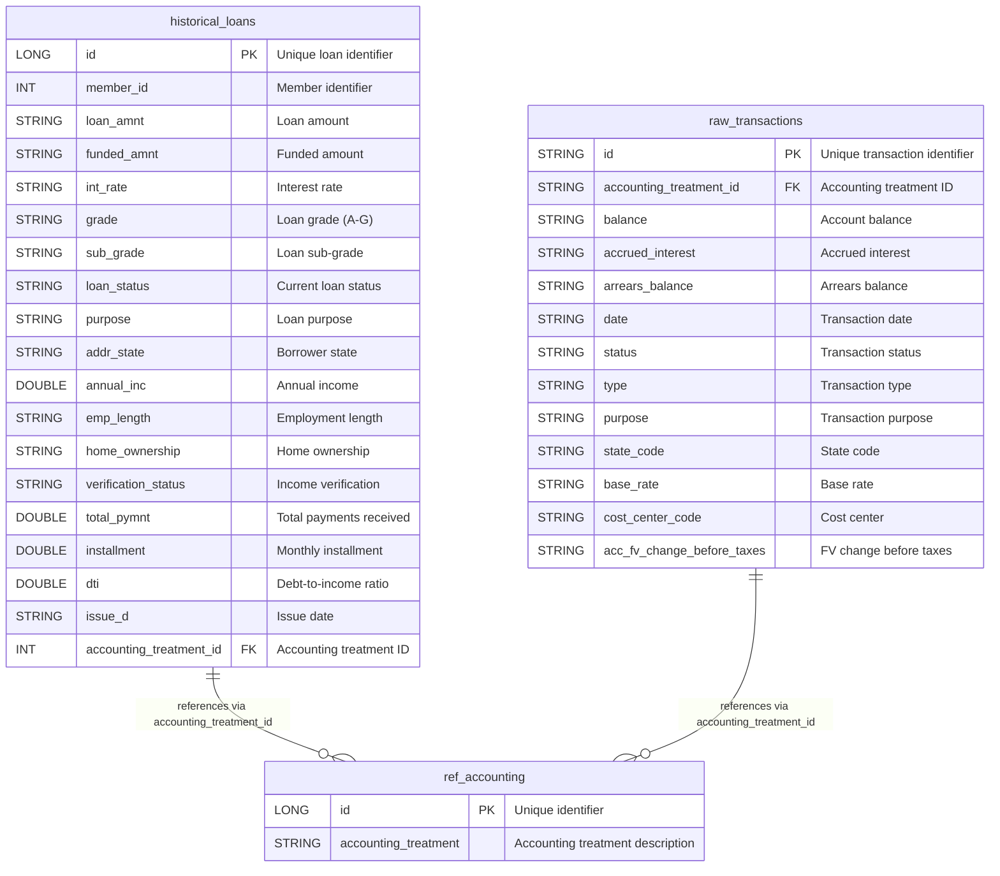

# Loan Analytics Dashboard

A Streamlit dashboard for analyzing loan data from Databricks Unity Catalog tables. This app provides interactive visualizations and insights for the `historical_loans`, `raw_transactions`, and `ref_accounting` tables.

## Features

- **Loan Portfolio Overview**: Summary statistics and key metrics
- **Loan Status Analysis**: Distribution of loans by status with visualizations
- **Monthly Trends**: Time series analysis of loan originations
- **Transaction Analysis**: Analysis of transaction patterns and volumes
- **Custom Queries**: Execute custom SQL queries against the loan data

## Cursor MCP

In the `./cursor/mcp` folder you'll see:
- `function.sql`: Update the `catalog` and `schema`, then run the query in Databricks to define the UDF to make it available as a managed MCP from Databricks
- `example_mcp.json`: Copy the JSON, fill in your details, and add this to the `mcp.json` in your Cursor Settings, this will give Cursor access to understand the structure of your tables in the specified location. 
These files DO NOT need to live in your project repo. **DO NOT** commit any tokens to any repositories.

## Project Structure

```
cursor_example/
├── app.py                           # Main Streamlit application (entry point)
├── src/                             # Supporting modules (well-organized)
│   ├── __init__.py                  # Main exports and query manager instance
│   ├── database_connection.py      # Database connection management
│   ├── query_manager.py             # Query execution and caching
│   ├── models/                      # Data models and schemas
│   │   ├── __init__.py
│   │   └── table_schemas.py         # Table definitions and field mappings
│   ├── queries/                     # SQL queries organized by domain
│   │   ├── __init__.py
│   │   ├── loan_queries.py          # Loan analysis queries
│   │   ├── transaction_queries.py   # Transaction analysis queries
│   │   └── accounting_queries.py    # Accounting queries
│   └── utils/                       # Utility functions (extensible)
│       └── __init__.py
├── app.yaml                         # Databricks App configuration
├── databricks.yml                   # Asset Bundle configuration
├── requirements.txt                 # Python dependencies
├── README.md                        # This documentation
├── DEPLOYMENT.md                    # Deployment guide
└── .gitignore                       # Git ignore patterns
```

## Architecture

- **Frontend**: Streamlit web application (`app.py`)
- **Data Layer**: Modular query system with domain-specific organization
- **Connection Management**: Cached database connections with error handling
- **Query Organization**: Separate classes for loans, transactions, and accounting
- **Schema Management**: Proper field mappings and data type handling
- **Authentication**: Service principal authentication for secure data access
- **Data Source**: Unity Catalog tables in the `efeld_cuj.loan_io` schema

## Key Features

### 🏗️ **Clean Architecture**
- **Separation of Concerns**: Database, queries, and UI are cleanly separated
- **Domain Organization**: Queries organized by business domain (loans, transactions, accounting)
- **Proper Field Mappings**: Handles string-to-numeric conversions and date parsing
- **Error Handling**: Comprehensive error handling with user-friendly messages

### 📊 **Rich Analytics**
- **Loan Analysis**: Portfolio overview, status distribution, grade analysis, geographic analysis
- **Transaction Analysis**: Payment tracking, status-based analysis, recovery metrics
- **Accounting Analysis**: Balance analysis, interest calculations, state-level accounting
- **Risk Analysis**: Grade-based risk assessment and employment analysis

## 📊 Data Model

The application analyzes data from three main tables in the `efeld_cuj.loan_io` schema:

### Entity Relationship Diagram



### Table Descriptions

#### 🏦 **historical_loans** (140+ columns)
- **Primary Data Source**: Contains comprehensive loan portfolio data
- **Key Fields**: Loan amounts, grades, borrower demographics, payment history
- **Purpose**: Main source for loan analytics, risk assessment, and portfolio analysis
- **Relationships**: Links to `ref_accounting` via `accounting_treatment_id`

#### 💳 **raw_transactions** (24 columns)  
- **Primary Data Source**: Accounting and financial transaction records
- **Key Fields**: Balances, accrued interest, transaction types and statuses
- **Purpose**: Financial accounting analysis, balance tracking, interest calculations
- **Relationships**: Links to `ref_accounting` via `accounting_treatment_id`

#### 📋 **ref_accounting** (2 columns)
- **Reference Table**: Simple lookup table for accounting treatment descriptions
- **Key Fields**: ID and treatment description
- **Purpose**: Provides human-readable accounting treatment names
- **Relationships**: Referenced by both `historical_loans` and `raw_transactions`

### Data Relationships

- **One-to-Many**: Each accounting treatment can apply to multiple loans and transactions
- **Lookup Integration**: The `ref_accounting` table provides descriptive names for accounting treatments
- **Cross-Analysis**: Enables joined analysis between loan characteristics and accounting treatments

## 🧪 Testing

The project includes a comprehensive test suite with both unit and integration tests.

### Test Structure

```
tests/
├── conftest.py              # Shared fixtures and configuration
├── unit/                    # Unit tests for individual components
│   ├── test_database_connection.py
│   ├── test_query_manager.py
│   └── test_table_schemas.py
├── integration/             # Integration tests for workflows
│   ├── test_end_to_end.py
│   └── test_streamlit_integration.py
└── test_runner.py           # Convenient test runner script
```

### Running Tests

#### Using pytest directly:
```bash
# Run all tests
pytest

# Run unit tests only
pytest tests/unit -v

# Run integration tests only
pytest tests/integration -v

# Run tests with coverage
pytest --cov=src --cov-report=html

# Run fast tests (exclude slow ones)
pytest -m "not slow"
```

#### Using the test runner:
```bash
# Run all tests
python tests/test_runner.py test

# Run with coverage report
python tests/test_runner.py coverage

# Run linting
python tests/test_runner.py lint

# Run formatting
python tests/test_runner.py format
```

#### Using Makefile:
```bash
# Install development dependencies
make install-dev

# Run all tests
make test

# Run tests with coverage
make test-cov

# Run linting and formatting
make lint format
```

### Test Coverage

The test suite covers:
- ✅ **Database connection handling** with mocked Databricks SQL connections
- ✅ **Query execution logic** with different data scenarios
- ✅ **Schema validation** for all table definitions
- ✅ **Field mapping accuracy** ensuring SQL generates correctly
- ✅ **Error handling** for connection failures and invalid queries
- ✅ **Streamlit integration** with caching and UI components
- ✅ **End-to-end workflows** from query request to result display

## Deployment

This application is deployed using Databricks Asset Bundles (DABs) and runs as a Databricks App.

### Prerequisites

- Databricks workspace with Unity Catalog enabled
- SQL warehouse configured and running
- Service principal with access to the loan data tables

### Configuration Files

- `app.yaml`: Databricks App configuration
- `databricks.yml`: Asset Bundle configuration
- `requirements.txt`: Python dependencies

### Environment Variables

- `DATABRICKS_WAREHOUSE_ID`: SQL warehouse ID for query execution
- `DATABRICKS_HOST`: Databricks workspace hostname
- `DATABRICKS_CLIENT_ID`: Service principal client ID (auto-injected)
- `DATABRICKS_CLIENT_SECRET`: Service principal secret (auto-injected)

### Deployment Commands

```bash
# Deploy the application
databricks bundle deploy --target dev --profile DEFAULT

# Deploy the Streamlit app
databricks apps deploy loan-analytics-dashboard-v2 --source-code-path "<bundle-path>" --profile DEFAULT
```

## Data Sources

### Tables Used

1. **`efeld_cuj.loan_io.historical_loans`**
   - Loan portfolio data with origination details
   - Key columns: `loan_id`, `borrower_id`, `loan_amount`, `loan_status`, `origination_date`

2. **`efeld_cuj.loan_io.raw_transactions`**
   - Transaction records related to loans
   - Key columns: `transaction_id`, `loan_id`, `transaction_type`, `amount`, `transaction_date`

3. **`efeld_cuj.loan_io.ref_accounting`**
   - Reference accounting information
   - Key columns: `account_id`, `account_type`, `balance`

## Usage

1. Select analysis type from the sidebar
2. View interactive visualizations and metrics
3. Use filters to drill down into specific data segments
4. Export results or run custom queries as needed

## Security

- Uses Databricks service principal authentication
- All queries execute with app-level permissions
- Data access governed by Unity Catalog policies
- No user credentials stored or transmitted

## Support

For issues or questions, please contact the development team or refer to the Databricks Apps documentation.
